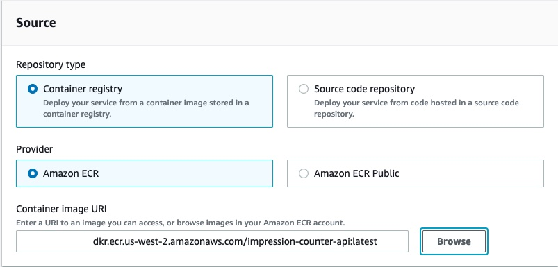
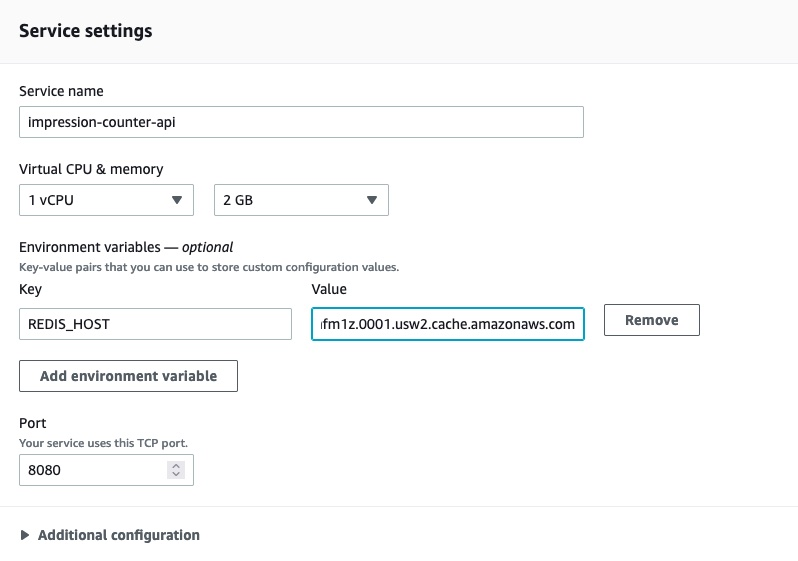
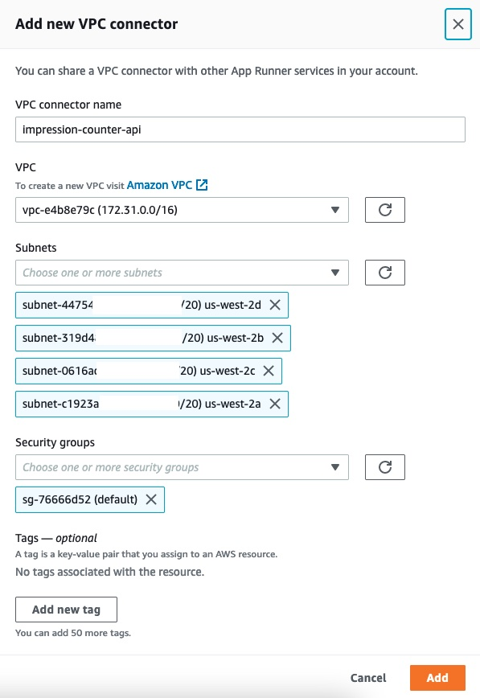
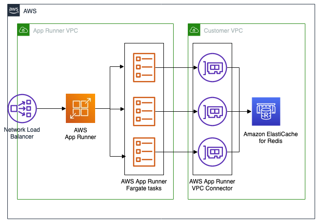

# Impression counter api running in app-runner

This is a sample code repository showcasing how to use [AWS App Runner](https://aws.amazon.com/apprunner/) for running an API server written in [Golang](https://go.dev) that counts page impression, and store the counter in [Amazon Elasticache for Redis](https://aws.amazon.com/elasticache/redis/) private resource. This sample use the VPC support [feature](https://aws.amazon.com/blogs/aws/new-for-app-runner-vpc-support/) that provide access to private resources inside the VPC.

To connect to your VPC, AWS App Runner private resources use a VPC Connector, that connects App Runner services into a VPC as describe in [this](https://docs.aws.amazon.com/apprunner/latest/dg/network-vpc.html) documentation.

AWS App Runner [image-base service](https://docs.aws.amazon.com/apprunner/latest/dg/service-source-image.html) allow to run any docker container image in any development language, and [Code-base service](https://docs.aws.amazon.com/apprunner/latest/dg/service-source-code.html) on supported languages App Runner will build the service source code on the service runtime docker images, removing the need to manage build infrastructure.

## Prerequisite

1. Create an Elasticache redis cluster. A single `cache.t4g.micro` is enough for this sample. Make sure to have a security group that will allow access to the App Runner service.
2. Build this sample code and push it to your region ECR repository

```bash
REGION='us-west-2'
ACCOUNT_ID=$(aws sts get-caller-identity | jq -r '.Account')

REPO_URI=$(aws ecr create-repository --region ${REGION} --repository-name impression-counter-api | jq -r '.repository.repositoryUri')

docker build -t ${REPO_URI}:latest .

aws ecr get-login-password --region ${REGION} | docker login --username AWS --password-stdin ${ACCOUNT_ID}.dkr.ecr.${REGION}.amazonaws.com

docker push ${REPO_URI}:latest
```

## Setup

This is a manual step by step that will install this sample code inside your VPC, Using this sample will have costs in your account.

>There is also a terraform [plan](./terraform/) that do all the steps listed in the manual setup.
>The terraform plan uses a [local-exec](https://www.terraform.io/language/resources/provisioners/local-exec) provisioner to build a docker image for this service, this terraform plan is not for **production** use.

1. Create the AWS App Runner Service
2. Choose the Repository type: Container registry, and the Provider Amazon ECR. Browse and select the repository name `impression-counter-api` and the latest tag.


3. In the Deployment settings, if you have a service-role, select it, and if you don't have a service role, choose **Create a new service role**, and click next
4. Set the service name `impression-counter-api`, add an Environment variable for the redis host url, the key is `REDIS_HOST` and the value is your elasticache redis primary URL.

5. Scroll down and open the Networking section and select `Custom VPC` and click add new.
6. In the **Add new VPC connector** set the name of the connector `impression-counter-api` select the VPC and at least subnets, and assign the security group that was created in the prerequisite section to allow access from our new App Runner service to the private Elasticache Redis, and click Add

7. Click Next, review all the settings and click `Create & Deploy`
8. Once the service is ready, click the service default domain to see the service.

## Architecture



## Security

See [CONTRIBUTING](CONTRIBUTING.md#security-issue-notifications) for more information.

## License

This library is licensed under the MIT-0 License. See the [LICENSE](./LICENSE) file.
